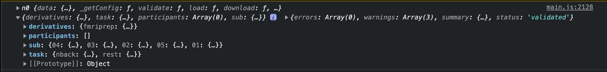

# Community Bonding Period
**May 20 - June 12**

## June 8th
Today, I focused on another contract—but, generally, you can now reliably get and create new files with `freerange`.

### Weekly Meeting Notes
- We will launch at the Congress (September 4–8) in a workshop
- We are implementing a standardized crowdsourced test to see if the SCORE artifact schema is complete. 
- We are making SCORE more usable by putting it into a FOSS software! Get more people involved in using it!
- Look at annotations that other people have made (e.g. TUH corpus). What is their list?
- Write to the BIDS Validator to expose HED library configuration
- Create a list of functions specific to our aims from existing software platform

## June 7th
1. Fixed hidden filesystem editor
    - It was actually updating the main one...
2. Fixed rendering Bosch's dataset
    - Had to remove some broken autoBIDSing code that I'd written before.
3. Fixed `freerange`
    - Only write to files that have registered changes
4. Finished more readings
    - Started to implement some helper functions related to CuBIDS—though they may not be relevant to our primary work with EEG-BIDS

## June 5th - June 6th
1. Continued updating `freerange` and integrating it into GEN. 
    - Now we can stream file changes directly into the user's filesystem from the browser!
    - We can also host files remotely and, at least for EDF files, use range requests to get only the necessary data.

## June 4th
1. Played around with remote datasets. Ended up finding out how to modify files in the local filesystem, removing the need for zipping
2. Created [freerange](https;//github.com/brainsatplay/freerange) library to hold generic file management code

## June 3rd
1. Fixed download button text
2. Renamed some keys to be compatible with the example HED artifact annotations sent by Tal.
3. Attending the Google Summer of Code Contributor Summit
4. Updated the file structure and documentation for GEN to be more organized
5. Updated the README.md file for GEN to present a set of clear goals and a roadmap
    - This is to support collaboration with other groups, such as the EEGNet LORIS team

## June 2nd
1. List artifacts instead of annotate the names directly on the plot
    - Can also show/hide and the button will highlight the artifact when you hover it!
2. Fixed tiny bug where a cached tag that does not exist will not allow you to annotate (which stopped the meeting demo last night...)
3. Developed a basic stacked plot with support for selective montage viewing
    - Tried to support relayout when toggling lines on/off in the legend (i.e. as a montage selector), but it didn't work the way that was expected
    - Also cannot overlay subplots because they have a background

## June 1st
1. Created an IterativeFile that allows for loading data from the file buffer only when it is needed.
    - This results in a 800x improvement in export speed because we can avoid recompressing .nii files

### Meeting #2 with Mentors
1. Can we repurpose the AnyWave software or simply use it as a model?
2. What are the benefits of a dedicated server (NAS) for this particular project?

## May 31st
1. Fixed getDirectory (again...) where we can take a shortcut to the correct directory given a filename rather than searching the whole file tree.
2. Created a simplified UI that shows the first channel of an EDF file.

## May 30th
1. Lots of reading about EEG-BIDS and HED tags.
2. Experimentation with EEG2BIDS tool
    - It doesn't let me convert because "No EDF file selected"...
3. Place HED annotation in BIDS files!
    - **Issue:** The `bids-validator` throws an error about the tags since they're part of a library—and I don't know how to load a lib...
4. Fix EDF file exporting
5. Export, reload, and display HED annotations!
    - **Note:** Arbitrarily only showing those under the `artifact` header..
6. Removed the assumption that we need ses- subdirectories...
    - Note: This will still be useful to add with more than one session—but not now. It requires us to update a *lot* of metadata.

7. Generalized getting sidecars from the BIDSDataset class.

## May 29th
1. Shared the project with EEGLab and HED people that Pedro connected me with via email
2. Allow for free text specification on loaded HED schemas
3. Fixed service worker registration to check the network for new updates
4. Completed the first draft of a *bids2bids* conversion for adding expected files and reformatting directories / filenames to conform with the BIDS standard.
    - One known issue is that it doesn't change metadata within files (e.g. scan files, where there may be a reference to a file that has now been renamed)
5. Listened to the EEGLab presentation shared by Pedro
5. Renamed the project from `artifact` to `ged` to reflect the broader goals of the Global EEG Norms project.

## May 28th
*Welp, I finally caught COVID...*
1. Styled the timeseries graph embedded in the dataset inspector
2. Loaded the SCORE schema

## May 27th
1. Visually annotate the first channel of an EDF file on Plotly
2. Reformatted the demo with the [visualscript](https://github.com/brainsatplay/brainsatplay/tree/main/src/visualscript), one of my other OS projects. Fixed several problems with how `visualscript` formats nested dashboards.

## May 26th
1. Loaded EDF and NWB files into the browser
2. Implented granular read on the EDF decoder since many files are very large and immediate buffer-parsing stalls the browser. It couldn't even handle more than two of my test files in memory!
3. Fixed WebNWB's ingestion of h5wasm (as the API surface has changed...)
4. Created a dummy .xml file for the artifacts ontology
5. Cloned [hed-examples](https://github.com/hed-standard/hed-examples) to have access to BIDS files with valid HED tags

## May 25rd
1. Loading all files as their filenames to avoid confusion about interpretation.
    - Having issues with compressed NiFTI images—though [bids-validator](https://github.com/bids-standard/bids-validator) also has an issue. Get a good (uncorrupted) dataset!
2. Can re-export the BIDS dataset as a .zip folder. You can optionally check using the [bids-validator](https://github.com/bids-standard/bids-validator) before allowing!
    - Issues with NiFTI headers when imported again...

### Meeting with Mentors (#1)
#### What I Need
[x] Nice EEG dataset—ideally with HED tags

#### Next Steps
[ ] Arbitrarily add an HED tag to an existing dataset

[ ] Lobby bids-validator to expose more of their API at the JavaScript object level (i.e. with objects as inputs)

[x] Check out [hed-schema-library](https://github.com/hed-standard/hed-schema-library) for how to register a new HED schema that we create for artifacts

#### What They Will Do
[ ] Add me to their neuroimaging Mendeley group

[x] Introduce me to the EEG BIDS and EEGLab groups and make them aware of our project

#### Clarifications
Our project is about *standards* in EEG data. We are only beginning with artifacts in resting-state EEG...but that is not the end.

The outcome is a dashboard that is useful for neurophysiology specialists who don't know anything about BIDS—and probably don't care.

## May 24rd
1. Commented on an [Issue](https://github.com/hed-standard/hed-javascript/issues/11) about the current hed-validator documentation
    - It turns out that the documentation has not been updated for quite a while—and they have developed an entirely new interface to work inside [bids-validator](https://github.com/bids-standard/bids-validator) that relies on an events file and merged JSON sidecars. So the last day was not very useful...
2. Loading .tsv, .json, and .gzip files into a JavaScript object, influenced by the [bids-validator](https://github.com/bids-standard/bids-validator) (which doesn't natively expose any methods to load objects...)
3. Created a rough frontend that allows for viewing and validating a BIDS dataset as a JavaScript object!

## May 23rd
1. Loaded HED schema files from the browser and used them to validate strings provided by the user with an `<input>` tag!

## May 22nd
1. Forked [bids-validator](https://github.com/bids-standard/bids-validator) and  [hed-javascript](https://github.com/hed-standard/hed-javascript) to begin dissecting how they handle BIDS files.
2. Rewrote the [hed-javascript](https://github.com/hed-standard/hed-javascript) repo for ES6 import/export support (so that it can be browser-native...)